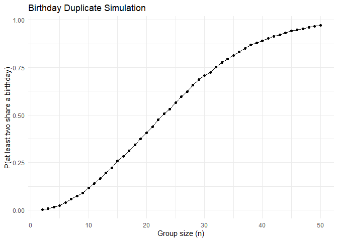
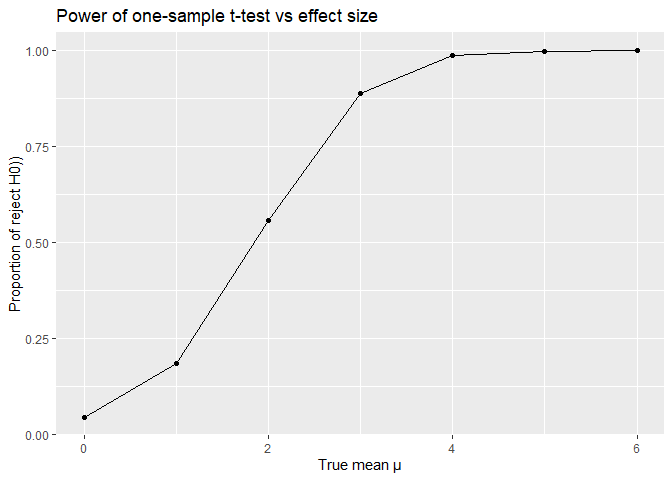
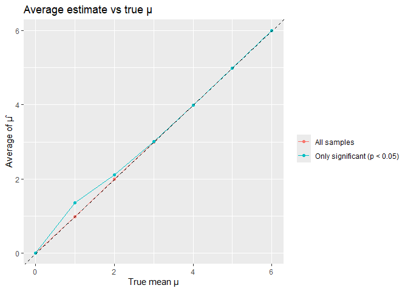

p8105_hw5_rl3616
================
Ruipeng Li
2025-11-14

``` r
library(tidyverse)
```

    ## ── Attaching core tidyverse packages ──────────────────────── tidyverse 2.0.0 ──
    ## ✔ dplyr     1.1.4     ✔ readr     2.1.5
    ## ✔ forcats   1.0.0     ✔ stringr   1.5.2
    ## ✔ ggplot2   4.0.0     ✔ tibble    3.3.0
    ## ✔ lubridate 1.9.4     ✔ tidyr     1.3.1
    ## ✔ purrr     1.1.0     
    ## ── Conflicts ────────────────────────────────────────── tidyverse_conflicts() ──
    ## ✖ dplyr::filter() masks stats::filter()
    ## ✖ dplyr::lag()    masks stats::lag()
    ## ℹ Use the conflicted package (<http://conflicted.r-lib.org/>) to force all conflicts to become errors

``` r
set.seed(123)
```

### Problem 1

``` r
has_duplicate_birthday <- function(n) {
  b <- sample(1:365, size = n, replace = TRUE)
  any(duplicated(b))
  }
group_size = 2:50
n_sim = 10000

birthday_results <- map_df(
  group_size,
  ~ tibble(
    n = .x, 
    dup = replicate(n_sim, has_duplicate_birthday(.x))
    )
  )

prob_by_n <- birthday_results |>
  group_by(n) |> 
  summarise(prob_dup = mean(dup), .groups = "drop")

prob_by_n
```

    ## # A tibble: 49 × 2
    ##        n prob_dup
    ##    <int>    <dbl>
    ##  1     2   0.0033
    ##  2     3   0.0079
    ##  3     4   0.0158
    ##  4     5   0.0248
    ##  5     6   0.0387
    ##  6     7   0.057 
    ##  7     8   0.0749
    ##  8     9   0.0885
    ##  9    10   0.116 
    ## 10    11   0.140 
    ## # ℹ 39 more rows

``` r
ggplot(prob_by_n, aes(x = n, y = prob_dup)) +
  geom_line() +
  geom_point() +
  labs(
    x = "Group size (n)",
    y = "P(at least two share a birthday)",
    title = "Birthday Duplicate Simulation"
    ) +
  theme_minimal()
```

<!-- --> As
shown in the plot, when the group size is very small, the probability of
having a shared birthday is close to zero. As the group size increases,
the probability rises rapidly. Around a group size of 25, the rate of
increase begins to slow down, and eventually the probability approaches
100%.

### Problem 2

``` r
n <- 30
sigma <- 5
n_sim <- 5000
mu_vec <- 0:6

sim_one_mu <- function(mu, n = 30, sigma = 5, n_sim = 5000) {
  
  map(1:n_sim, ~{
    x <- rnorm(n, mean = mu, sd = sigma)
    
    t_tidy <- broom::tidy(t.test(x, mu = 0))
    
    tibble(
      mu_true = mu,
      mu_hat = t_tidy$estimate,
      p_value = t_tidy$p.value
    )
  }) |> 
    list_rbind()
}

mu_sim_results <- map_df(mu_vec, sim_one_mu)

mu_sim_results
```

    ## # A tibble: 35,000 × 3
    ##    mu_true mu_hat p_value
    ##      <int>  <dbl>   <dbl>
    ##  1       0 -0.424  0.642 
    ##  2       0  1.34   0.220 
    ##  3       0 -1.85   0.0246
    ##  4       0 -0.759  0.373 
    ##  5       0 -1.03   0.259 
    ##  6       0  0.502  0.521 
    ##  7       0  0.442  0.573 
    ##  8       0 -0.539  0.593 
    ##  9       0 -0.293  0.739 
    ## 10       0  0.955  0.271 
    ## # ℹ 34,990 more rows

#### proportion of times the null was rejected

``` r
power_by_mu <- mu_sim_results |>
  group_by(mu_true) |>
  summarise(
    power = mean(p_value < 0.05),
    .groups = "drop"
  )

power_by_mu
```

    ## # A tibble: 7 × 2
    ##   mu_true power
    ##     <int> <dbl>
    ## 1       0 0.046
    ## 2       1 0.186
    ## 3       2 0.558
    ## 4       3 0.888
    ## 5       4 0.987
    ## 6       5 1.000
    ## 7       6 1

``` r
rej_prop_plot <- power_by_mu |> 
  ggplot(aes(x = mu_true, y = power)) +
  geom_line() +
  geom_point() +
  labs(
    x = "True mean μ",
    y = "Proportion of reject H0",
    title = "Power of one-sample t-test vs effect size"
  ) +
  ylim(0,1)

rej_prop_plot
```

<!-- -->

When μ = 0, H₀ is true, and the rejection rate is approximately 0.05
(which is α).

The further μ is from 0 (in this case, increasing in the positive
direction), the larger the effect size, the easier it is for the t-test
to detect differences, and the higher the power until it reach to 1.

#### mu estimate plot

``` r
mu_hat_avg <- mu_sim_results |> 
  group_by(mu_true) |> 
  summarise(
    mean_mu_hat_avg = mean(mu_hat),
    .groups = "drop"
  )

mu_hat_rej <- mu_sim_results |> 
  filter(p_value < 0.5) |> 
  group_by(mu_true) |> 
  summarise(
    mean_mu_hat_rej = mean(mu_hat),
    .groups = "drop"
  )

mu_estimate_plot <- mu_hat_avg |> 
  left_join(mu_hat_rej, by = "mu_true") |> 
  ggplot(aes(x = mu_true)) +
    geom_line(aes(y = mean_mu_hat_avg, color = "All samples")) +
    geom_point(aes(y = mean_mu_hat_avg, color = "All samples")) +
    geom_line(aes(y = mean_mu_hat_rej, color = "Only significant (p < 0.05)")) +
    geom_point(aes(y = mean_mu_hat_rej, color = "Only significant (p < 0.05)")) +
    geom_abline(slope = 1, intercept = 0, linetype = "dashed") +
    labs(
      x = "True mean μ",
      y = "Average of μ̂",
      color = "",
      title = "Average estimate vs true μ"
    )

mu_estimate_plot
```

<!-- -->
Across all samples, the average sample mean (μ̂) is approximately equal
to the true μ, so the red line roughly falls on y=x.

However, if we only consider samples with p \< 0.05, only the samples
with “larger differences” are retained, while samples with smaller
differences are excluded.

This causes the μ̂ of the retained samples to tend to be slightly larger
than the true μ, so the blue line will appear on y=x, especially when
the true μ is relatively small.
